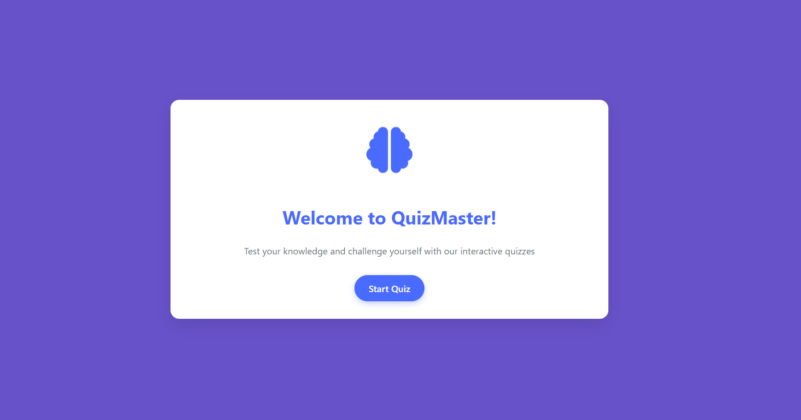

# 🧠 Responsive Quiz App

Welcome to the **Responsive Quiz App** — a clean, user-friendly, and fully responsive quiz application built for all screen sizes. Whether you're on mobile, tablet, or desktop, enjoy a smooth and interactive quiz experience!

## 🚀 Features

- ✅ **Clean UI Design** – Minimal and attractive interface for distraction-free focus.
- 📱 **Responsive Layout** – Works perfectly across all devices (mobile, tablet, desktop).
- 🎯 **6 Quiz Categories** – Choose from 6 different topics to test your knowledge.
- 🧩 **Custom Question Count** – Select how many questions you want to attempt.
- ⏱️ **30-Second Timer** – Each question comes with a countdown for quick thinking.
- 🟢 **Instant Feedback** – 
  - Correct answers highlight green.  
  - Incorrect ones turn red with the correct answer displayed.
- ➡️ **Next Question Button** – Appears instantly after a correct answer.
- 🏁 **Results Page** – Shows:
  - Total questions attempted  
  - Correct vs Incorrect answers  
  - Your speed and performance
- 💡 **Motivational Quote** – Get inspired based on your result!
- 🏠 **Navigation Buttons** – Return home or restart the quiz easily.

## 💻 Technologies Used

- HTML
- CSS
- JavaScript

## 📸 Screenshots



## 📂 Folder Structure
/quiz-app
├── index.html
├── style.css
├── script.js
└── assets/

## 🔧 How to Use

1. Clone the repository:
   ```bash
   git clone https://github.com/yourusername/quiz-app.git

Open index.html in your browser.

Start the quiz and enjoy!

📝 Note
This app was made with attention to detail and responsiveness in mind. I'm a bit late to post it, but I believe it's never too late to share your work! 😊
Your support and feedback means a lot to me — I hope you all will support and encourage me to grow more! 💪

📣 Connect With Me
GitHub: AniqaKhan07

LinkedIn: https://www.linkedin.com/in/aniqa-khan-7638b3344/
